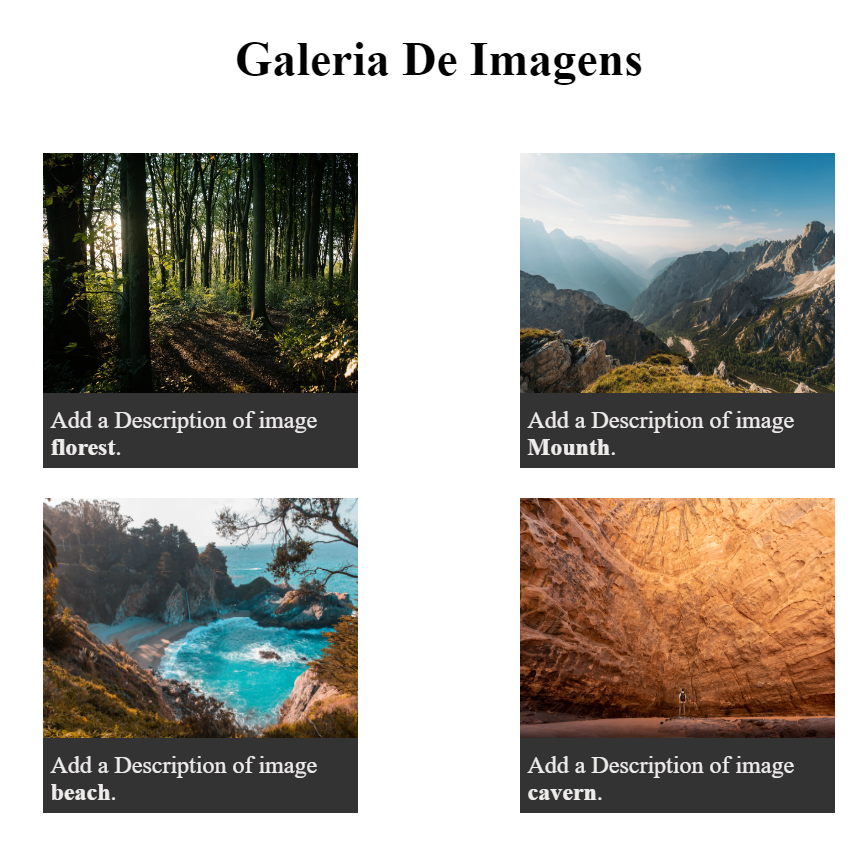

# Galeria de imagem 

Este é um projeto básico para testar conhecimentos em HTML e CSS.

## Estrutura de Arquivos

- `index.html`: O arquivo HTML principal.
- `styles.css`: O arquivo CSS para estilização.

